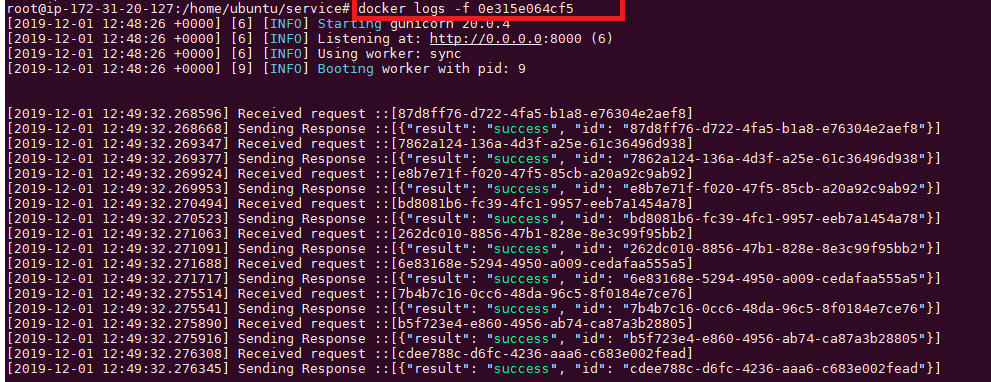
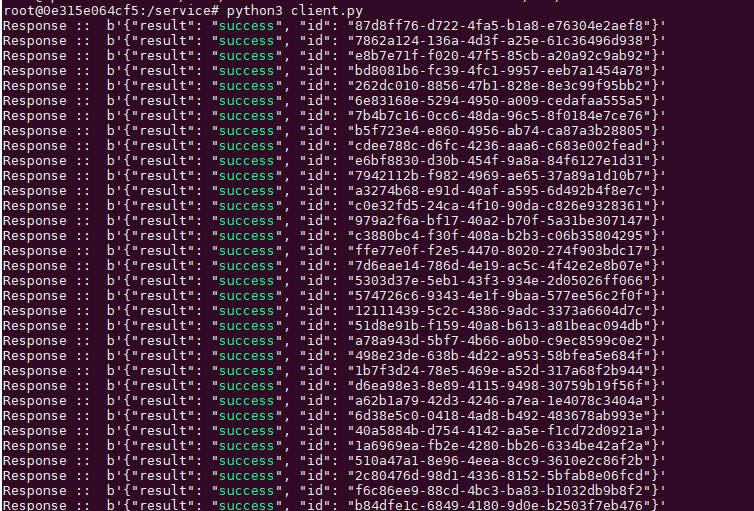

# A sample service - How to deploy one simple python based service/api in production ?

In this article - [https://github.com/sughosneo/async-rest](https://github.com/sughosneo/async-rest) we have seen how we can create
highly performance oriented async based rest services. We have done comparison in terms of performance as well.

But in this particular article we would only focus on the those simple services which we actually write most of the times and how it's performance varies
based on just choosing the right deployment strategy.    

As you are aware if you are planning to write a rest based service either you would choose a Flask or Falcon framework possibly 8 out 10 times, 
until and unless you have any prior specific requirements in your mind. But the question is how do you actually serve or deploy those 
in production ? Should you use their in built App server or ```from wsgiref import simple_server```. We all know that any web server 
which supports WSGI standard through that we would be able to deploy the service/api. But the question is would that be good enough to handle multiple request in production ?
The answer is "NO". As per the Flask/Falcon documentation it's recommended that someone should only use ***```gunicorn or uWSGI```***
And for the proxy server Nginx would definitely be preferable. In your mind if the question arise - what could possibly the difference.
You can run below steps to check it out of your own.

User can follow below steps to run this ***Info*** Service within docker.

***```With gunicorn```***
-------------------------

```python
        git clone https://github.com/sughosneo/service.git
        
        cd service
        
        docker build . -t service:1.0                
        
        docker run -p 8000:8000 service:1.0 &                                
```

Once you run those above commands you would notice that below output is coming up :



The sample client in this project actually based on the asyncio module and would only work with Python 3.7 onwards. 
So if you don't have the local environment not configured to run the below ```python3 client.py```. So better you get into the working container
itself, that would help you to run the client with ease. For that you can use below commands : 

```python
        
        docker exec -it 0e315e064cf5 /bin/bash
        
        python3 client.py
```

Once you run the client you would notice below output.



***```With wsgiref http simple server ```***
--------------------------------------------

We are not creating one separate Dockerfile for this direct service to test. We would directly get into the container and 
then run the InfoSvc.py

```python

    docker exec -it 0e315e064cf5 /bin/bash
    
    python3 InfoSvc.py
```

Then you would require to change the configuration of the ***client.py*** as by default with simple http server it runs on ***port 5000***.


You would notice carefully the time this default web server is taking to process those 100 request. It's much slower than the previous one.

***```Conclusion```***
-------------------

Both the scenarios server was processing the request synchronously. But in the gunicorn approach it actually generates few of the work threads to process the incoming request 
and in the second scenario single thread itself was trying to process all the request. Though gunicorn is also supports async workers. But by design it's synchronous.

So don't worry if you are running something synchronous. It's not bad always. If your design and requirements supports that then you can always develop
some service of this sort and deploy it with correct strategy in place.


